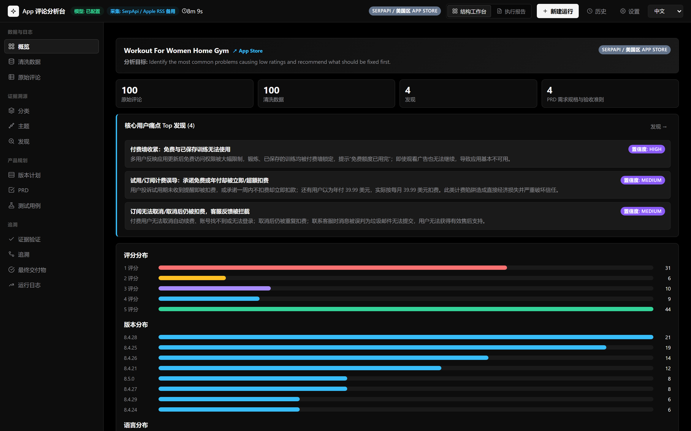
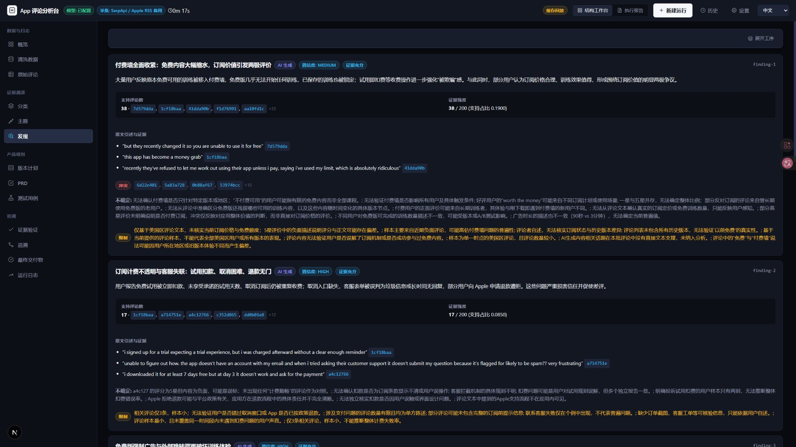
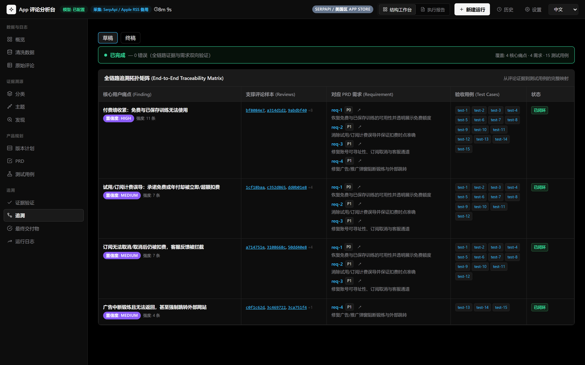
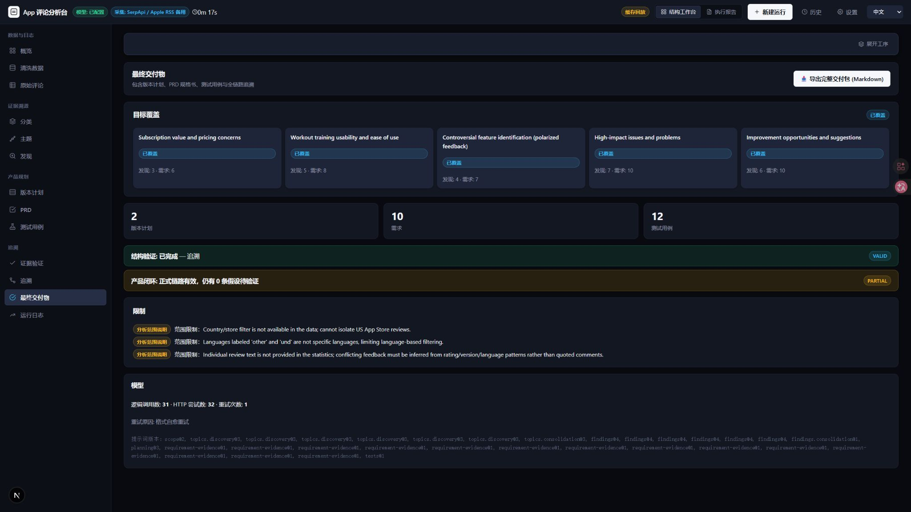

# App Review Insights

[English](README.en.md) · **[中文](README.md)**

Local, model-driven analysis of App Store user reviews into
evidence-grounded product plans. Enter an App Store URL from the US or China
storefront (reviews always come from the US), or import a review dataset, pick
an analysis goal, and the app collects, cleans, analyzes, plans, and validates
— surfacing the whole workflow and every intermediate artifact.

**One command to run:** `npm run dev` then open http://localhost:3000.

## What it does

1. **Scope** — interprets a free-form goal into generic filters and explicit
   limitations (model + rules).
2. **Collect / Import** — accepts a US or **China App Store** page
   (`https://apps.apple.com/us/...` or `https://apps.apple.com/cn/...`); both
   resolve to the same app id and are collected through the fixed
   `/us/rss/customerreviews/...` URL, so reviews always come from the US
   storefront. JSON/CSV datasets are also accepted.
3. **Clean** — NFC normalization, exact dedupe, deterministic stats.
4. **Topics** — dynamic theme discovery (model), no fixed taxonomy, with the
   candidate quotes surfaced in a **Classification** tab.
5. **Findings** — user problems grounded in specific reviews with exact
   excerpts (model + code-verified evidence), audited in an
   **Evidence Validation** stage.
6. **Version Planning + PRD** — requirements traceable to findings, each
   carrying seven planning factors. Severity, User Impact, Implementation
   Scope, Dependencies and rationale come from the model; Evidence Strength,
   Confidence and Frequency are recomputed by code. Priority is capped and
   dependencies are validated deterministically.
7. **Tests** — test cases linked to requirements and source reviews (model).
8. **Traceability** — deterministic validation of the whole chain, with a
   single constrained revision on failure. Revised runs keep **Draft/Final**
   (attempt 1 vs attempt 2) side by side for PRD, tests, traceability and the
   version plan; never-revised runs show "Final · no revision required".

Every run persists a complete file snapshot under `data/runs/<runId>/` and
appends stage events to `events.ndjson`, which can be replayed offline as a
**Cached Replay**. Cached runs that predate these P1 artifacts show a clear
fallback instead of fabricated data.

## Screenshots

From a real analysis run of Workout for Women (US App Store), shown in the
Chinese UI (captured at 2× resolution — click to view full size):

**Workbench overview — rating / version / language distributions and cleaning details**



**Findings & evidence — exact excerpts with review-ID badges and confidence**



**Traceability matrix — the full review → finding → requirement → test chain**



**Final deliverables — goal coverage, version plan, and the export entry**



## Quick Start

Requirements: Node.js 22+.

```bash
npm ci
npm run dev
# open http://localhost:3000
```

For the live model-driven path you must configure a model (see below). Without
a model you can still:

- run the bundled real **Cached Replay** (offline demo) from the UI's
  **Cached Replay** mode, which lists replayable runs with no model and no
  network; and
- import and clean datasets: collection/import, dedupe, and stats run, then the
  run completes with a `MODEL_NOT_CONFIGURED` limitation (no model call is
  attempted).

## Network Environment

The app runs locally (`http://localhost:3000`), but live collection and model
analysis need outbound network access to:

- `itunes.apple.com` — the Apple customer-reviews RSS (fallback collection path);
- `serpapi.com` — the SerpApi Apple Reviews primary source (after `SERPAPI_API_KEY` is configured);
- your configured `MODEL_BASE_URL` — the model analysis endpoint.

Direct connections to these services from mainland China are usually slow or
unreachable, so you need network access to US-based services (e.g. a global
proxy or a US node).

Two points to note:

- **Storefront is independent of your proxy**: the collection URLs are pinned to
  the US storefront in code (Apple RSS uses `/us/rss/...`, SerpApi uses
  `country=us`), so reviews always come from the US store regardless of which
  node you connect through.
- **Node does not use env-var proxies**: the server uses Node's native `fetch`,
  which does not read `HTTP_PROXY` / `HTTPS_PROXY` environment variables by
  default. Use a **TUN / system-level transparent proxy** (recommended); if your
  proxy only works via environment variables, set `NODE_USE_ENV_PROXY=1` before
  starting, otherwise collection may time out on direct connections.

Cached replay and import analysis do not need outbound network access or a proxy.

### Known phenomenon: both sources return empty for high-traffic apps

For very high-download apps (Duolingo / Chase scale), live collection can hit
**both sources returning empty at the same time**: SerpApi reports rate or
quota exhaustion (`SERPAPI_RATE_OR_QUOTA_EXHAUSTED` — check your quota in the
console and retry), while the fallback Apple RSS also returns an HTTP 200 with
an empty body (marked `suspect-empty`, never interpreted as "this app has no
reviews"). The system records the corresponding limitations honestly and stops
collection — **it never fabricates data**. For live demos prefer a mid- or
low-traffic app, or use the cached replay mode (offline and stable).

## Background Tasks and Refresh Recovery

Analysis is decoupled from the browser connection and runs as a background task:

- `POST /api/runs` returns `202` immediately with `{ runId, status: "running",
  eventsUrl }`; the pipeline then runs in the background via Next.js `after()`.
  **Refreshing the page, switching history, or starting another task never
  cancels a running analysis.** Request-shape errors still return 4xx
  `application/problem+json`.
- Multiple tasks run in parallel; the **History** panel is the unified task
  list, refreshed every 2s to show all concurrent tasks. Each task has its own
  `runId`, event publisher, and snapshot directory, so events and artifacts
  never cross-wire.
- The client polls `GET /api/runs/{runId}/events?afterSequence=N` incrementally,
  receiving `{ runId, status, events, lastSequence }`. A single failed poll shows
  "Reconnecting…" and keeps retrying — only the authoritative status or a
  terminal event decides the outcome. Cached replay reveals artifacts strictly in
  event order; the final report is readable only after its `artifact.available`
  event, so stages never race ahead of the report.
- On refresh the newest `running` task is restored, otherwise the last-viewed run
  (falling back to the idle page when that id no longer resolves). After a
  process restart, a leftover `running` run reads as `interrupted` and can be
  retried or deleted; a genuinely running task cannot be deleted (`409`).
  No resume-after-restart is supported.

### Single-instance constraint (important)

This is a **single-process, single-instance local app**. A run's status is
decided by the on-disk manifest plus an in-process active-run registry
(`running`/`interrupted`); there is **no** cross-process task coordination,
distributed lock, or database:

- Do not horizontally scale against the same `data/runs/` (or `RUNS_DIR`) — a
  second instance cannot see the first instance's running tasks (it would read
  them as `interrupted`) and two instances writing the same run directory can
  trample each other.
- A process restart never resumes in place; `interrupted` runs recover only via
  "retry" (a brand-new `runId`, full re-run), never from the last stage.
- Deploying to multiple instances/replicas requires a Redis/DB task-state layer
  first (out of scope; not implemented).

## Data Sources and Limitations

- **Primary source (when configured):** [SerpApi](https://serpapi.com) Apple
  Reviews engine `GET /search.json` with the fixed parameters
  `engine=apple_reviews`, `product_id={appId}`, `country=us`, `sort=mostrecent`,
  `no_cache=true` (forced fresh, bypassing SerpApi's cache). Authentication uses
  a server-held `api_key` from `SERPAPI_API_KEY`. The `serpapi_pagination.next`
  URL is never trusted — it only signals "there is a next page", and the next
  page URL is rebuilt by the app from the trusted base URL. The application-layer
  cap is fixed at 500 reviews / 20 pages; each page typically returns ~25
  reviews, so a full 500-review collection usually costs at most ~20 successful
  searches (actual page count from SerpApi). SerpApi is never auto-retried:
  repeating a `no_cache=true` request under uncertain network results could
  create extra successful searches, so the user explicitly re-checks instead.
  Configure via **Settings → Data collection platform** or `SERPAPI_API_KEY` in
  your local `.env.local`; see below.
- **Explicit fallback:** when SerpApi is unconfigured, returns an
  auth/quota/parameter error, returns an explicit empty result, fails
  transiently, or times out, the app falls back to Apple Customer Reviews RSS.
  The reason is always surfaced as a limitation (server-sanitized, no raw
  upstream text) and labeled **Apple RSS fallback** in the UI; local history is
  separate and never presented as live.
- **Partial failures:** RSS fallback happens only when SerpApi's first page
  yields no valid reviews; once SerpApi has returned valid reviews, a later-page
  failure marks the result `partial` and keeps the collected pages — RSS reviews
  are never mixed in.
- **Live (fallback path):** Apple Customer Reviews RSS
  (`/us/rss/customerreviews/page={1..10}/id={id}/sortBy=mostRecent/json`),
  fetched sequentially, at least 500 ms apart, max 10 pages, no concurrency.
  Each page's raw response, safe headers, timestamps, SHA-256, and HTTP
  attempt number are preserved. This is a live network source; the local cache
  is never presented as it.
- **Bounded, visible retries.** An HTTP 200 empty page 1 is retried twice
  (2s / 5s, cache-busted) before being accepted as `suspect-empty`. A page that
  is empty while `rel=last` still advertises more pages is confirmed once after
  2s and then reported as `partial` (`RSS_UNSTABLE_PAGINATION`); repeated pages
  are detected before appending (`RSS_REPEATED_PAGE`). There are no hidden or
  unbounded retries.
- **This is a best-effort window, not the full review history.** Apple provides
  no public SLA for this feed; it typically exposes only roughly the most
  recent pages (≤ ~10 × 50 entries).
- **Empty pages are ambiguous.** A page that returns HTTP 200 with no entries is
  marked `suspect-empty` and never reported as "this app has no reviews".
- **Partial failures** (a page fails after earlier pages succeeded) continue the
  analysis with the collected reviews and propagate the limitation everywhere.
- **Local review cache & hybrid sources.** Live reviews (whether from SerpApi or
  an RSS fallback) are merged into a local, per-app cache under
  `data/source-cache/` (git-ignored), deduped by review id and capped at the 500
  most recent. A live run first previews the sample — the form's primary action
  is **Check review sample**, which shows a live sample and a stable (cached)
  sample and lets you choose. Choosing the stable sample isolates by App ID,
  dedupes, newest-first, and caps at 500 local-history reviews. Stable samples
  are never disguised as a complete live collection, and choosing one is not a
  fresh fetch.
- **Import:** provenance of imported data cannot be verified by this app; you
  are responsible for its authenticity and lawful use.
- **Aggregate ratings** (via iTunes Lookup) are shown only as context; they are
  not review text and never substitute for review collection.

## Model Provider and Configuration

| Env | Meaning |
|---|---|
| `MODEL_BASE_URL` | OpenAI-compatible API root (client appends `/chat/completions`) |
| `MODEL_API_KEY` | bearer token; may be empty for local runtimes |
| `MODEL_NAME` | model identifier |
| `MODEL_JSON_MODE` | `prompt` (default) or `json_object` |

Copy `.env.example` to `.env` (git-ignored) and fill in your values. Keys are
never logged, persisted, or committed. Temperature is fixed at 0.1.

**You can also configure the model from the UI:** open **Settings** in the
header to set the API Base URL, API Key, Model Name, and JSON mode. Saving
applies the values immediately (no restart) and persists them to the local,
git-ignored `data/config.local.json` so they survive a restart; `.env.local` /
`.env` still apply as startup configuration, so existing setups need no
migration. The API key is never returned to the client — the panel only shows
whether one is configured, with an option to clear it.

**Data collection platform (SerpApi):** save your SerpApi API Key in the
password field under **Settings → Data collection platform**, or set
`SERPAPI_API_KEY=` directly in your local `.env.local` (as startup
configuration). Saving/clearing applies immediately without a restart. The key is held server-only and used for
forced-fresh live App Store reviews; it never enters the browser bundle, HTTP
responses, logs, preview JSON, run snapshots, or git-tracked files — the panel
only shows "configured / not configured" with no view/copy/masked-tail. Never
paste a real key into README, `.env.example`, screenshots, or issue text; a key
disclosed in chat should be rotated in the SerpApi console before use. Only
loopback overrides of `SERPAPI_BASE_URL` are allowed for tests (production must
use `https://serpapi.com`). The SocialCrawl integration has been removed; old
replays may still show legacy source provenance.

For the bundled demo fixtures the analysis used a DeepSeek-compatible endpoint
(`deepseek-v4-flash`); that configuration is documented in each fixture's
`provenance.json` and is **not** required to replay them.

> [!IMPORTANT]
> **Model Selection and Compatibility Note:**
> - **Recommended Model**: The entire development and end-to-end benchmark baseline is built and verified against **`deepseek-v4-flash`**. It delivers the highest fidelity and compliance for structured JSON outputs, strict schema contracts, and exact evidence substrings.
> - **Switching to Other Models (e.g., Qwen series)**: The analysis pipeline enforces strict deterministic Zod schema validation across all stages (such as requiring non-empty supporting citations and canonical ID prefixes). When switching to other models (such as Alibaba Cloud Qwen, Llama, or other open-weight/commercial models), minor discrepancies—such as empty supporting arrays (`supportingReviewIds: []`), omitted fields, or slight formatting drifts during chunked analysis—can trigger `MODEL_SCHEMA_VIOLATION` errors and cause runs to fail. If you experience instability, switch back to the recommended `deepseek-v4-flash` model.

See `docs/model-analysis.md` for per-stage rules-vs-model rationale, prompt
versions, and failure handling.

## Prompt and Hallucination Controls

- Prompts in `src/server/model/prompts/*.ts` (one file per version), versioned (`scope@2`, …).
- Review text is always treated as **untrusted data**; prompts forbid following
  reviewer instructions.
- Every model result is validated against a Zod schema.
- The model only ever receives the goal, reviews with stable IDs, deterministic
  stats, and previously-allowed IDs.
- Evidence excerpts must be exact substrings of the cited review's normalized
  body (NFC + whitespace-folded + case-folded; the excerpt may differ from the
  original in letter case); sample counts and confidence are computed by code,
  never taken from the model.
- Findings with no valid support are deleted; unsupported ideas become separate
  `assumptions`, never requirements.
- Traceability is validated deterministically; a single constrained revision
  may delete/fix/downgrade but may not add citations or new excerpts. A second
  failure is explicit: the run ends with `run.failed` and a failed manifest
  carrying `TRACEABILITY_INVALID_AFTER_REVISION` — never a fabricated success.
  Revised artifacts are published as attempt-02 so the UI never shows stale
  pre-revision output.

## Import Format

`docs/import-format.md` documents the JSON v1 and CSV v1 schemas, required
fields, limits, and validation behavior. Same-origin dedupe is exact only.

## Traceability Rules

`review → finding → requirement → test`:

- A `finding` cites ≥1 review, **each** backed by an exact excerpt; its sample
  count and confidence are code-derived. A support review without an exact
  excerpt is dropped rather than inflating the sample.
- **Evidence Sufficiency (deterministic v1)** — every finding gets a code
  verdict on whether its evidence can support a *broad or critical* claim. A
  finding is `insufficient` when it has fewer than 3 supporting reviews, a
  support ratio below 1% of the reviewed corpus, a non-`complete` data source,
  or as many conflicts as supporting reviews (any one condition suffices). An
  `insufficient` finding survives as a limited, auditable fact — it is never
  deleted and never passes for "no evidence" — but it cannot produce a P0/P1
  requirement or a target version: a requirement backed only by insufficient
  findings is pinned to `P2` with `versionId: null` and dropped from every
  version's scope. When no finding survives validation at all, the pipeline
  stops after scope/topics/findings with an `INSUFFICIENT_EVIDENCE` limitation
  and a `completed/insufficient-evidence` outcome; it is never replayed as a
  complete analysis.
- The user's analysis goal is interpreted into generic scope filters
  (rating/version/language/date) that are actually applied: later stages only
  analyze reviews matching the scope.
- A `requirement` references ≥1 finding; its source reviews are the union of
  those findings' evidence.
- A `test` references ≥1 requirement and only reviews inside the union of the
  cited requirements' evidence; every requirement must be covered. A test's
  direct **Finding IDs and Priority are derived by code** from the requirement
  graph (union of the linked requirements' findings; most urgent priority) and
  validated the same way — the model never supplies them, and tampering is
  rejected as `TEST_FINDING_MISMATCH` / `TEST_PRIORITY_MISMATCH`.
- Assumptions are never requirements and never generate tests.
- **Legacy replay compatibility.** Cached artifacts produced before the
  sufficiency / direct-finding contracts stay replayable: findings without an
  `evidenceSufficiency` field show confidence only, and test cases missing
  `findingIds` / `priority` have them derived from their requirements at the
  display layer. Bundled fixtures are not rewritten.
- See `src/domain/traceability/validate.ts` for the full invariant list.

## Cached Replay and Data Authenticity

- Every run can be replayed offline from its snapshot with no network and no
  model; the UI's **Cached Replay** mode lists replayable runs and re-materializes
  all artifacts under a fresh run id, labeled **Cached Replay**, and it never
  calls Apple or the model.
- Two **real** demo fixtures ship under `fixtures/demo-runs/`, each a real
  capture from the US App Store analyzed by a real model, privacy-minimized,
  with full provenance:
  - `run-x-twitter-us/` — App ID 333903271 ("X");
  - `run-workout-for-women-us/` — App ID 839285684 ("Workout for Women"), the
    assessment's primary example.
  - Shipping two different app categories is intentional: it demonstrates the
    pipeline is not hard-coded to any single app.
  - Each fixture retains review id / rating / title / body / version / timestamp
    and removes reviewer nickname, author URI, and sensitive headers; its
    `provenance.json` records capture time, source URL pattern, storefront,
    model, temperature, and prompt versions.
- Real snapshots are marked as such. The app never pretends a mock, a rule
  fallback, or a static text is a live model result.

## Failure Handling

- Distinct error codes for network / HTTP / timeout / non-JSON / schema
  violations, surfaced as `run.failed` events with stage and error preserved.
- Model calls are retried a bounded number of times: at most **3 attempts**
  (an initial attempt plus up to 2 retries) with 1s/2s backoff. Only transient
  failures retry — 5xx, network errors, per-call timeouts, and non-JSON/
  truncated responses. 4xx, schema violations, and client disconnects fail
  immediately. Every retry surfaces as a `stage.progress` message (e.g.
  `model retry 2/3 in 1s (MODEL_HTTP_ERROR)`), and the run manifest's
  `modelUsage` records `attempts`, `retries`, and `retryReasons` (never the
  response body or key). RSS also retries the first page a bounded number of
  times (see Data Sources).
- Without a model, import/live analysis still runs the deterministic stages
  (collect/import, clean, dedupe, stats) and completes with a
  `MODEL_NOT_CONFIGURED` limitation; catalog and cached replay always work.

## Testing

```bash
npm run lint
npm run typecheck
npm run test:unit          # domain, server, model, components
npm run test:integration   # pipeline, import, revision, replay, real fixture
npm run build
npm run test:e2e           # live (stubbed upstream), import, cached-replay
npm run verify             # lint + typecheck + coverage + build
```

Coverage thresholds (lines/statements/functions/branches ≥ 80%) apply to
`src/domain/**` and `src/server/**`.

## Project Structure

```text
src/domain/contracts/    Zod schemas (reviews, analysis, events, runs)
src/domain/reviews/      normalize, dedupe, language, stats
src/domain/analysis/     evidence, confidence
src/domain/traceability/ deterministic validator
src/server/sources/      App Store URL, Apple RSS collector/parser, import
src/server/model/        OpenAI-compatible client, scripted client, prompts
src/server/runs/         run store, catalog, replay
src/server/pipeline/     stages + orchestrator
src/app/api/             config / runs / manifest / artifact routes
src/components/          bilingual workbench UI
src/i18n/                en / zh-CN dictionaries
scripts/                 capture + demo build + docs check
fixtures/demo-runs/      real, replayable snapshot
```

## Privacy and Security

- `.env*`, `data/runs/`, coverage and test artifacts are git-ignored.
- Review text is sent to your configured model endpoint; use one you trust.
- Run snapshots never contain the API key; model usage metadata records only
  provider/model/temperature/version/duration/tokens.
- Reviewer identity fields are not stored; the bundled fixture is
  privacy-minimized.
- This is a local, single-user app. Do not expose it directly to the public
  internet.

## Non-goals

No accounts, collaboration, cloud deployment, background queues, databases, or
App Store Connect private API. Fuzzy/embedding dedupe and unbounded or semantic
self-correction model retries are intentionally out of scope (transport-level
retries are bounded and visible, see Failure Handling).

---

[中文](README.md) · [English](README.en.md)
